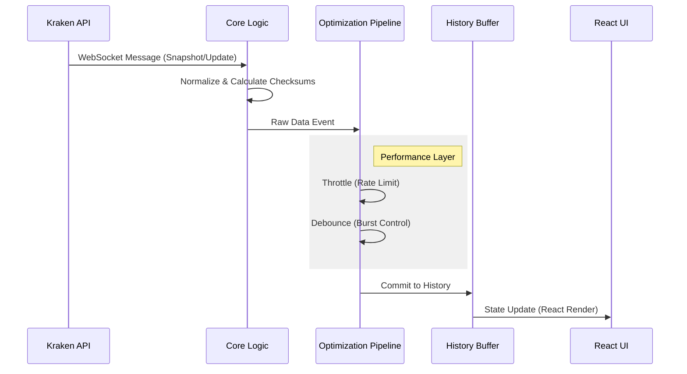

Krono processes high-frequency market data through a specialized pipeline designed to maintain UI performance without sacrificing data integrity.

## The Update Pipeline

The system uses an event-driven architecture. Rather than polling for data, the core `Orderbook` class emits events that propagate through the application layers.

### 1. Ingestion
The connection layer listens to the Kraken WebSocket v2 API. It handles:
* **Protocol Handshakes:** Establishing the secure connection.
* **Subscription Management:** Automatically subscribing to the `book` channel for the requested symbol.
* **Reconnection:** Handling network interruptions with exponential backoff strategies.

### 2. Processing & Optimization
Raw WebSocket data is often too fast for the human eye and the browser's rendering engine (often exceeding 60fps). Krono acts as a buffer to prevent performance degradation:

* **Throttling:** Ensures updates are emitted at a consistent rate (configurable via `throttleMs`). This prevents "UI jank" by limiting how often React is asked to re-render.
* **Debouncing:** In high-volatility bursts, the system can wait for the dust to settle before triggering a render (configurable via `debounceMs`).

### 3. History & Time Travel
Unlike standard WebSocket libraries that discard data immediately after display, Krono maintains a [Circular History Buffer](https://en.wikipedia.org/wiki/Circular_buffer).

* **Storage:** Processed snapshots are stored in memory up to a configurable limit.
* **Playback:** The "Time Travel" feature simply moves a pointer along this buffer, allowing the user to pause and scrub through recent market activity.
* **Replay:** This architecture allows the [useOrderbookPlayback](/hooks/api/useOrderbookPlayback) hook to replay market movements frame-by-frame with exact precision.

### 4. Consumption
Finally, the data is exposed via typed events. The architecture follows a unidirectional flow where the UI is a pure reflection of the current state in the history buffer.

<Note>
    The architecture is designed to handle the full throughput of Kraken's WebSocket feed, which can burst to hundreds of messages per second during high volatility, while keeping the UI responsive.
</Note>
