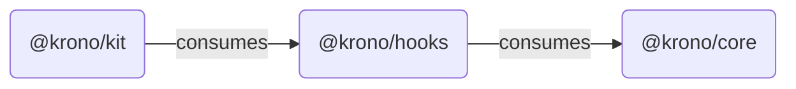

## The Three-Layer Architecture

Krono is designed as a monorepo containing three distinct packages that build upon one another. This layered approach enforces a strict separation of concerns, allowing developers to choose the level of abstraction that fits their needs.

### Packages

#### 1. Core (`@krono/core`)
The foundation of the library. It is entirely **framework-agnostic**, written in pure TypeScript.

* **Responsibility:** Manages WebSocket connections, internal orderbook logic, math, and data structures.
* **Key Feature:** Implements the event-driven update pipeline and history buffer.
* **Target Audience:** Developers using frameworks other than React (Vue, Svelte, Angular) or those needing raw data access without UI overhead.

#### 2. Hooks (`@krono/hooks`)
The React integration layer. It wraps the imperative Core logic into declarative React hooks.

* **Responsibility:** Manages component lifecycles (connecting/disconnecting), synchronizes Core state with React state, and provides context providers.
* **Key Feature:** Exposes `useOrderbook` and `useOrderbookPlayback` for easy integration.
* **Target Audience:** Developers building custom React UIs who want full control over the rendering logic but don't want to manage WebSocket state manually.

#### 3. Kit (`@krono/kit`)
The UI presentation layer. It contains pre-built, styled components.

* **Responsibility:** Provides ready-to-use visual components built with **shadcn/ui** and **Tailwind CSS**.
* **Key Feature:** Includes complex interactive elements like the Time Travel timeline, settings panels, and symbol pickers.
* **Target Audience:** Developers who want a "drop-in" solution to render a beautiful, functional orderbook immediately.

<Info>
    While `@krono/kit` offers the fastest integration, advanced users often mix `@krono/hooks` with their own custom UI components to match their specific design system.
</Info>
