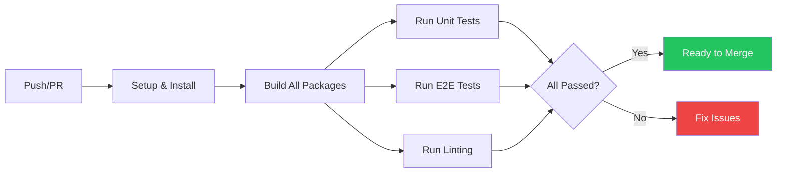

This guide outlines our contribution workflow, from creating a branch to submitting a pull request, ensuring a smooth collaboration process.

## Workflow

<Steps>
    <Step title="Fork & Branch">
        Fork the repository and create a new branch for your specific feature or fix:
        ```bash
        git checkout -b feature/my-new-feature
        ```
    </Step>
    <Step title="Make Changes">
        Implement your changes. Ensure you follow the code style enforced by Biome and that all tests pass.
    </Step>
    <Step title="Commit">
        We follow [Conventional Commits](https://www.conventionalcommits.org/). Write clear, descriptive messages:
        ```bash
        git commit -m "feat(hooks): add useOrderbookSpread hook"
        ```
    </Step>
    <Step title="Submit PR">
        Push your branch and open a pull request. Provide a clear description of the problem you are solving.
    </Step>
</Steps>

## CI/CD Pipeline

Every push to `main` or a pull request triggers our automated pipeline to ensure stability.



## Need Help?

If you get stuck or find a bug, don't hesitate to reach out.

<CardGroup cols={2}>
    <Card title="Open an Issue" icon="github" href="https://github.com/fapiper/krono/issues">
        Report bugs or request features
    </Card>
    <Card title="Email Support" icon="at-sign" href="mailto:hello@fabianpiper.com">
        Contact me directly
    </Card>
</CardGroup>
